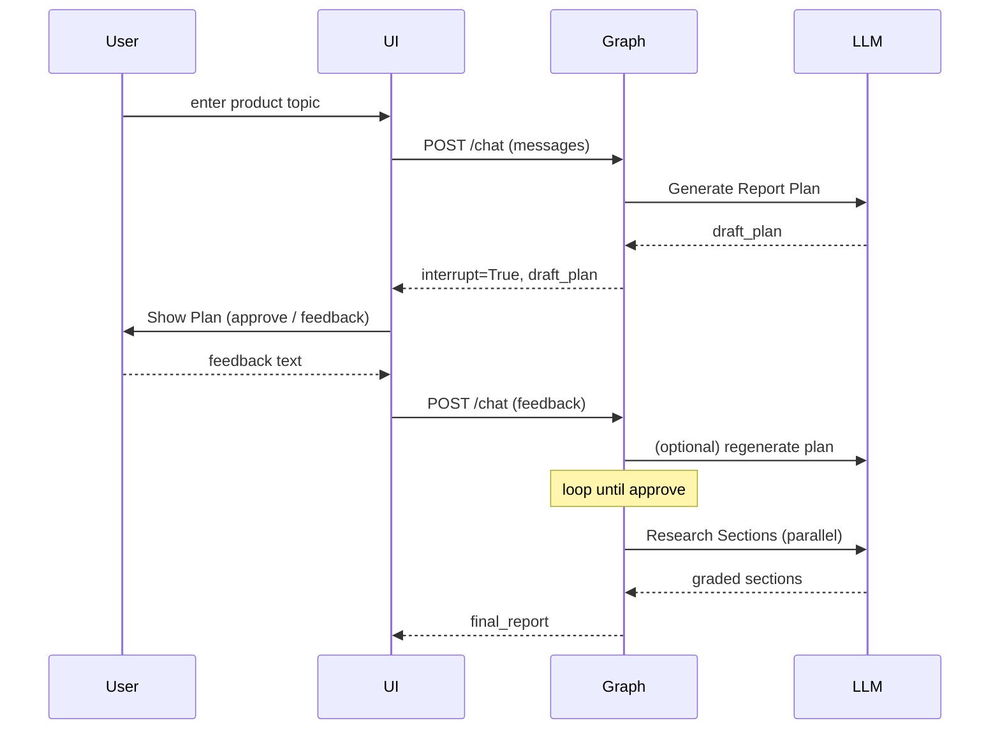

# Human-in-the-Loop (HITL) Interaction Guide

> Version: 0.1 (2025-07-01)  
> Applies to: DeepResearch workflow + Product-Recommendation platform

---

## 1. Why Keep a Human in the Loop?

| Challenge | Pure-LLM Workflow Limitation | How HITL Solves It |
|-----------|------------------------------|--------------------|
| 모호한 요구사항 | LLM이 잘못된 가정을 한 채 연구/추천 진행 | 첫 턴 Clarify 질문으로 **요구사항을 명확화** |
| 계획 적합성 | 자동 생성된 섹션 구조가 사용자가 원하는 방향과 다를 수 있음 | Plan 초안을 **사용자에게 보여주고 승인/수정** 루프 |
| 품질 신뢰도 | "Hallucination" 위험 & 근거 부족 | Self-Grader + 사용자 피드백으로 **이중 검증** |

HITL 단계는 *필요할 때만* 실행되도록 설계해 **비용·속도**와 **품질·맞춤화** 간 균형을 맞춥니다.

---

## 2. LangGraph Pattern Overview

LangGraph는 `Command(goto=..., interrupt=True/False)` 형태로 **그래프 실행을 일시 중지**하고 외부 입력을 기다릴 수 있습니다.

1. **노드 A** 실행 → `Command(goto="ask_user", interrupt=True, update={...})` 반환  
2. Runtime이 그래프를 Pause → UI 에서 사용자의 입력 수집  
3. 입력을 `messages` 등 State에 넣고 Resume → **노드 B**부터 계속

> 공식 문서: [LangGraph › Concepts › Interrupt](https://langchain-ai.github.io/langgraph/concepts/interrupt/)

---

## 3. DeepResearch HITL Implementation

### 3-1. Clarify Stage (선택적)

```python
# deepresearch/src/open_deep_research/workflow/workflow.py  (요약)
if topic_is_ambiguous(user_request):
    clarifying_q = llm.invoke(CLARIFY_PROMPT)
    state["messages"].append(AIMessage(content=clarifying_q))
    # 사용자 답을 기다렸다가 다음 턴에서 continue
```

• 별도 `interrupt()` 호출 없이 **AIMessage(Clarify 질문)** 를 남기면 프론트엔드가 이를 감지해 사용자에게 보여줍니다.  
• 사용자가 답변하면 `HumanMessage` 가 `messages` 에 추가되어 다음 노드가 실행됩니다.

### 3-2. Report Plan Approval Loop

```python
# 1) generate_report_plan()
plan = llm.invoke(REPORT_PLAN_PROMPT)
return Command(
    goto="human_feedback",   # 다음 노드
    interrupt=True,            # 그래프 pause
    update={"draft_plan": plan}
)

# 2) human_feedback()
user_decision = state["messages"][-1].content   # True / str
if user_decision is True:        # 승인
    return Command(goto="research_sections")
else:                            # 피드백 문자열
    return Command(goto="generate_report_plan", update={"user_feedback": user_decision})
```

• **interrupt=True** 로 그래프가 멈추고 프런트엔드가 `draft_plan` 을 사용자에게 표시.  
• 사용자가 **True** (승인) 또는 **텍스트**(수정 요청) 를 보내면 루프가 재개됩니다.

> 최대 반복 횟수는 설정(`max_plan_iterations`, 기본 5)로 제한해 무한 루프를 방지합니다.

### 3-3. Where HITL Ends

• **Section Research** 이후에는 LLM Self-Grader가 품질을 보장하므로 추가 HITL 없이 진행.  
• 필요 시 `final_review` 같은 후처리 노드를 추가해 전체 보고서를 사용자에게 보여줄 수 있습니다.

---

## 4. UI / API Contract

| State 필드 | Type | 역할 |
|------------|------|------|
| `messages` | `List[BaseMessage]` | 대화 내역. Clarify/Feedback 질문·응답 모두 포함 |
| `draft_plan` | `str` | Plan 초안 (Markdown) |
| `already_clarified_topic` | `bool` | Clarify 재진입 방지 플래그 |

프런트엔드는 `stream` 또는 `poll` 방식으로 **State 업데이트**를 수신하고, `interrupt=True` 일 때 다음을 수행합니다:
1. 사용자에게 Draft(Plan 또는 Clarify Q) 렌더링  
2. 입력 값(True / 텍스트) 수집 후 `/chat` API 로 POST  
3. Runtime Resume → 응답 흐름 계속

---

## 5. Best Practices & Tips

• **질문 최소화**<br/>Clarify 질문은 1~2 문장, 선택지 예시를 함께 제시해 응답 부담을 낮춥니다.  
• **시각적 Diff 제공**<br/>Plan 수정 시 "이전 vs 신규" 하이라이트를 보여주면 사용자가 결정하기 쉽습니다.  
• **Fallback Timeout**<br/>사용자 응답이 X 분 내 없으면 자동 진행하거나 세션 휴면 처리.

---

## 6. Extending HITL to Product Recommendation

1. **Preference Slider Feedback**<br/>예산·브랜드 선호 등의 슬라이더 값 변경 시 `human_feedback` 단계에서 다시 Plan을 재계산.  
2. **Live Follow-up Q&A**<br/>리포트 후 사용자가 추가 질문 → Clarify 로직을 재사용해 *mini-loop* 실행.  
3. **Expert Review Slot**<br/>상태 `expert_notes` 를 추가해 외부 전문가가 코멘트를 남기면, `compile_final_report` 전에 자동 통합.

---

## 7. Sequence Diagram



다이어그램은 모든 노드 레이블을 "label" 로 감싸고 `<br/>` 대신 한 줄로 작성해 Mermaid 오류를 피했습니다.

---

### 참고 링크
- LangGraph Docs: Interrupt & Human-in-the-Loop  
- DeepResearch Code: `workflow/workflow.py`, `nodes/human_feedback.py`  
- Product-Recommendation Repo: `server/app/graph/graph.py` (Plan Approval)
