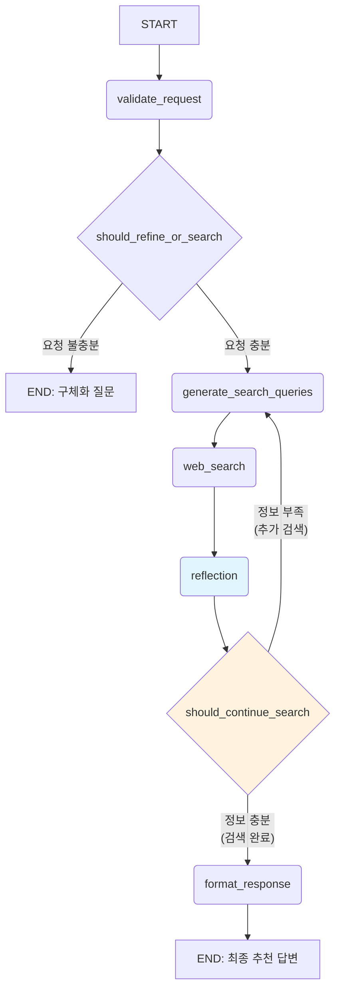

# 제품 추천 에이전트: LangGraph 아키텍처

## 1. 개요

본 문서는 `feature_1_product_competitor.md`에 명시된 요구사항을 충족시키기 위한 LangGraph 기반 AI 에이전트의 아키텍처를 설계합니다. 이 에이전트는 사용자의 제품 추천 요청을 이해하고, 웹 검색과 리뷰 분석을 통해 최종 제품 목록을 사용자에게 제안합니다. quickstart 프로젝트의 구현 패턴을 참고하여 실제 코드 레벨에서 구현 가능한 형태로 설계되었습니다.

## 2. 상태 (State) 정의

### 2.1. 메인 상태 - ProductRecommendationState

```python
from typing import TypedDict, List, Annotated
from langgraph.graph.message import add_messages
import operator

class Product(TypedDict):
    name: str
    source_url: str
    purchase_link: str
    review_summary: str
    price_range: str

class ProductRecommendationState(TypedDict):
    # 대화 기록 (LangGraph 표준)
    messages: Annotated[list, add_messages]
    
    # 사용자 요청 분석 결과
    is_request_specific: bool
    user_intent: str
    
    # 검색 관련 데이터
    search_queries: Annotated[list, operator.add]
    search_results: Annotated[list, operator.add]
    
    # 제품 데이터
    candidate_products: Annotated[list, operator.add]
    sources_gathered: Annotated[list, operator.add]  # 출처 추적
    
    # reflection 관련 상태
    is_sufficient: bool
    additional_queries: Annotated[list, operator.add]
    search_loop_count: int
    max_search_loops: int
    
    # 응답 데이터
    response_to_user: str
    
    # 설정값
    max_products: int
    search_depth: int
```

### 2.2. 보조 상태들

```python
class RequestValidationState(TypedDict):
    is_specific: bool
    clarification_question: str
    extracted_requirements: dict

class SearchQueryState(TypedDict):
    queries: List[str]
    rationale: str


```

## 3. 설정 (Configuration) 시스템

```python
from pydantic import BaseModel, Field

class ProductRecommendationConfig(BaseModel):
    # LLM 모델 설정
    validation_model: str = Field(default="gpt-4o-mini", description="요청 검증용 모델")
    search_model: str = Field(default="gpt-4o", description="검색어 생성용 모델")
    analysis_model: str = Field(default="gpt-4o", description="제품 분석용 모델")
    
    # 검색 설정
    max_search_queries: int = Field(default=3, description="최대 검색어 수")
    max_products_per_query: int = Field(default=5, description="검색어당 최대 제품 수")
    max_candidate_products: int = Field(default=10, description="최대 후보 제품 수")
    
    # 검색 도구 설정
    search_tools: List[str] = Field(default=["tavily", "serper"], description="사용할 검색 도구")
```

## 4. 노드 (Nodes) 상세 구현

### 4.1. validate_request - 요청 검증 노드

```python
from langchain_openai import ChatOpenAI
from langchain_core.messages import SystemMessage, HumanMessage

def validate_request(state: ProductRecommendationState, config: RunnableConfig) -> RequestValidationState:
    """사용자 요청의 구체성을 검증하고 필요시 구체화 질문을 생성합니다."""
    
    configurable = ProductRecommendationConfig.from_runnable_config(config)
    
    # LLM 초기화
    llm = ChatOpenAI(
        model=configurable.validation_model,
        temperature=0.1,
        max_retries=2
    )
    
    # 구조화된 출력을 위한 스키마 적용
    structured_llm = llm.with_structured_output(RequestValidationState)
    
    # 사용자 요청 추출
    user_message = get_latest_user_message(state["messages"])
    
    # 프롬프트 구성
    validation_prompt = get_validation_prompt(user_message)
    
    # LLM 호출
    result = structured_llm.invoke(validation_prompt)
    
    return {
        "is_request_specific": result.is_specific,
        "response_to_user": result.clarification_question if not result.is_specific else "",
        "user_intent": result.extracted_requirements.get("intent", "")
    }

def get_validation_prompt(user_message: str) -> List:
    """요청 검증을 위한 프롬프트 생성"""
    system_prompt = """당신은 제품 추천 전문가입니다. 사용자의 요청을 분석하여 제품 검색에 충분한 정보가 있는지 판단해주세요.

구체적인 요청의 기준:
- 제품 카테고리가 명확함 (예: 노트북, 이어폰, 키보드 등)
- 용도나 목적이 언급됨 (예: 게이밍용, 업무용, 학습용 등)
- 예산이나 가격대가 언급됨 (예: 10만원 이하, 가성비 등)
- 브랜드 선호도나 특정 기능 요구사항이 있음

불충분한 요청 예시:
- "키보드 추천해줘"
- "좋은 노트북 알려줘"
- "이어폰 뭐가 좋을까?"

충분한 요청 예시:
- "10만원 이하 가성비 좋은 게이밍 키보드 추천해줘"
- "대학생용 문서작업 노트북 추천, 예산 100만원"
- "운동할 때 쓸 무선 이어폰, 방수 기능 있는 걸로"

응답 형식:
- is_specific: true/false
- clarification_question: 불충분할 경우 구체화를 위한 질문 (한국어)
- extracted_requirements: 추출된 요구사항들"""

    return [
        SystemMessage(content=system_prompt),
        HumanMessage(content=f"사용자 요청: {user_message}")
    ]
```

### 4.2. generate_search_queries - 검색어 생성 노드

```python
def generate_search_queries(state: ProductRecommendationState, config: RunnableConfig) -> SearchQueryState:
    """구체화된 요청을 바탕으로 효과적인 검색어들을 생성합니다."""
    
    configurable = ProductRecommendationConfig.from_runnable_config(config)
    
    llm = ChatOpenAI(
        model=configurable.search_model,
        temperature=0.7,
        max_retries=2
    )
    
    structured_llm = llm.with_structured_output(SearchQueryState)
    
    user_intent = state.get("user_intent", "")
    user_message = get_latest_user_message(state["messages"])
    
    search_prompt = get_search_query_prompt(user_message, user_intent, configurable.max_search_queries)
    result = structured_llm.invoke(search_prompt)
    
    return {"search_queries": result.queries}

def continue_to_web_search(state: ProductRecommendationState):
    """LangGraph의 Send 이벤트를 사용한 동적 병렬 검색"""
    from langgraph.types import Send
    
    return [
        Send("web_search", {"search_query": query, "id": int(idx)})
        for idx, query in enumerate(state["search_queries"])
    ]

def get_search_query_prompt(user_message: str, user_intent: str, max_queries: int) -> List:
    """검색어 생성을 위한 프롬프트"""
    system_prompt = f"""당신은 제품 검색 전문가입니다. 사용자의 요청을 분석하여 효과적인 검색어를 생성해주세요.

검색어 생성 원칙:
1. 한국 커뮤니티와 리뷰 사이트에서 잘 검색될 수 있는 키워드 사용
2. 각 검색어는 서로 다른 관점을 다뤄야 함
3. 최대 {max_queries}개까지 생성
4. 브랜드명, 가격대, 용도, 성능 등 다양한 각도에서 접근

검색어 예시:
- "가성비 게이밍 키보드 추천 2024 디시"
- "10만원 이하 기계식 키보드 후기 클리앙"
- "로지텍 레이저 키보드 리뷰 사용기"

응답 형식:
- queries: 검색어 리스트
- rationale: 각 검색어를 선택한 이유"""

    return [
        SystemMessage(content=system_prompt),
        HumanMessage(content=f"사용자 요청: {user_message}\n추출된 의도: {user_intent}")
    ]
```

### 4.3. web_search - 웹 검색 노드

```python
from google.genai import Client
from langchain_google_genai import ChatGoogleGenerativeAI
import os

# Gemini 클라이언트 초기화
genai_client = Client(api_key=os.getenv("GEMINI_API_KEY"))

def web_search(state: dict, config: RunnableConfig) -> ProductRecommendationState:
    """Gemini API의 Google Search 기능을 사용하여 웹 검색을 수행하고 제품 후보를 추출합니다."""
    
    configurable = ProductRecommendationConfig.from_runnable_config(config)
    
    # 단일 검색어 처리 (병렬 처리용)
    query = state["search_query"]
    search_id = state["id"]
        try:
            # Gemini에 검색 프롬프트 구성
            search_prompt = f"""다음 검색어로 한국 제품 추천 사이트에서 정보를 찾아주세요: "{query}"

검색 시 주목할 사이트:
- 네이버 블로그, 카페
- 디시인사이드
- 클리앙
- 뽐뿌
- 다나와
- 쿠팡, 네이버쇼핑

각 검색 결과에서 다음 정보를 추출해주세요:
1. 추천 제품명 (정확한 모델명)
2. 가격 정보
3. 주요 특징 및 장점
4. 추천 이유
5. 출처 URL"""

            # Gemini API 호출 (Google Search 도구 포함)
            response = genai_client.models.generate_content(
                model=configurable.search_model,
                contents=search_prompt,
                config={
                    "tools": [{"google_search": {}}],
                    "temperature": 0.3,
                }
            )
            
            # grounding metadata에서 출처 정보 추출 (quickstart 방식)
            sources_gathered = []
            if hasattr(response, 'candidates') and response.candidates:
                candidate = response.candidates[0]
                if hasattr(candidate, 'grounding_metadata') and candidate.grounding_metadata:
                    for chunk in candidate.grounding_metadata.grounding_chunks:
                        if hasattr(chunk, 'web') and chunk.web:
                            sources_gathered.append({
                                "title": chunk.web.title,
                                "url": chunk.web.uri,
                                "search_id": search_id
                            })
            
            # 제품 정보 추출
            products = extract_products_from_search_result(response.text, sources_gathered)
            
            return {
                "search_queries": [query],
                "candidate_products": products,
                "sources_gathered": sources_gathered
            }
            
        except Exception as e:
            print(f"검색 오류 ({query}): {e}")
            return {
                "search_queries": [query],
                "candidate_products": [],
                "sources_gathered": []
            }

def extract_products_from_search_result(content: str, sources: List) -> List[Product]:
    """검색 결과에서 제품 정보를 추출합니다."""
    
    # 간단한 제품 정보 추출 (실제 구현에서는 더 정교한 파싱 필요)
    products = []
    
    try:
        # 검색 결과에서 제품 정보 추출 로직
        # 실제로는 LLM을 사용하여 구조화된 제품 정보 추출
        if "추천" in content and ("제품" in content or "상품" in content):
            product = {
                "name": "검색된 제품",  # 실제로는 파싱하여 추출
                "source_url": sources[0]["url"] if sources else "",
                "purchase_link": "",
                "review_summary": content[:200] + "...",  # 요약
                "price_range": "가격 정보 없음"
            }
            products.append(product)
    except Exception as e:
        pass
    
    return products

def get_product_extraction_prompt() -> str:
    """제품 추출을 위한 프롬프트"""
    return """검색 결과에서 제품 정보를 추출해주세요.

추출할 정보:
- 제품명 (정확한 모델명 포함)
- 가격대 (언급된 경우)
- 주요 특징이나 장점
- 추천 이유
- 정보 출처 (URL)

추출 불가능한 경우 "정보 없음"으로 응답하세요.

응답 형식:
제품명: [제품명]
가격대: [가격 정보]
특징: [주요 특징]
추천이유: [추천 이유]
출처: [URL]"""
```

### 4.4. reflection - 결과 평가 노드

```python
def reflection(state: ProductRecommendationState, config: RunnableConfig) -> ProductRecommendationState:
    """검색 결과를 평가하고 추가 검색이 필요한지 판단합니다."""
    
    configurable = ProductRecommendationConfig.from_runnable_config(config)
    
    llm = ChatGoogleGenerativeAI(
        model=configurable.analysis_model,
        temperature=0.1,
        max_retries=2,
        api_key=os.getenv("GEMINI_API_KEY")
    )
    
    # 현재 검색 결과 분석
    user_message = get_latest_user_message(state["messages"])
    candidate_products = state["candidate_products"]
    search_queries = state["search_queries"]
    
    reflection_prompt = get_reflection_prompt(user_message, candidate_products, search_queries)
    
    structured_llm = llm.with_structured_output(ReflectionResult)
    result = structured_llm.invoke(reflection_prompt)
    
    return {
        "is_sufficient": result.is_sufficient,
        "additional_queries": result.additional_queries if not result.is_sufficient else [],
        "search_loop_count": state.get("search_loop_count", 0) + 1
    }

def get_reflection_prompt(user_request: str, products: List, queries: List) -> List:
    """결과 평가를 위한 프롬프트"""
    system_prompt = """당신은 제품 추천 결과를 평가하는 전문가입니다.

사용자 요청과 현재 검색 결과를 분석하여 다음을 판단해주세요:

1. 현재 결과가 사용자 요청을 충족하는가?
2. 제품 다양성이 충분한가?
3. 가격대별 옵션이 적절한가?
4. 추가 검색이 필요한 영역이 있는가?

충분한 경우: is_sufficient = true
부족한 경우: is_sufficient = false, 추가 검색어 제안

응답 형식:
- is_sufficient: true/false
- additional_queries: 추가 검색어 리스트 (부족한 경우만)
- gap_analysis: 부족한 부분 설명"""

    products_summary = "\n".join([f"- {p.get('name', '알 수 없음')}: {p.get('price_range', '가격 미상')}" for p in products[:5]])
    
    return [
        SystemMessage(content=system_prompt),
        HumanMessage(content=f"사용자 요청: {user_request}\n\n기존 검색어: {queries}\n\n현재 제품 목록:\n{products_summary}")
    ]

class ReflectionResult(BaseModel):
    is_sufficient: bool = Field(description="현재 결과가 충분한지 여부")
    additional_queries: List[str] = Field(description="추가 검색어 목록")
    gap_analysis: str = Field(description="부족한 부분 분석")

def should_continue_search(state: ProductRecommendationState) -> str:
    """추가 검색 필요성에 따른 라우팅 결정"""
    max_loops = state.get("max_search_loops", 2)
    current_loop = state.get("search_loop_count", 0)
    
    if state.get("is_sufficient", False) or current_loop >= max_loops:
        return "format_response"
    else:
        return "generate_search_queries"
```

### 4.5. format_response - 응답 포맷팅 노드

```python
def format_response(state: ProductRecommendationState, config: RunnableConfig) -> ProductRecommendationState:
    """최종 추천 결과를 사용자 친화적인 형태로 포맷팅합니다."""
    
    user_message = get_latest_user_message(state["messages"])
    candidate_products = state["candidate_products"]
    
    if not candidate_products:
        response = "죄송합니다. 요청하신 조건에 맞는 제품을 찾지 못했습니다. 다른 키워드로 다시 검색해보시겠어요?"
    else:
        response = format_product_recommendations(user_message, candidate_products)
    
    return {"response_to_user": response}

def format_product_recommendations(user_request: str, products: List[Product]) -> str:
    """제품 추천 결과를 마크다운 형식으로 포맷팅"""
    
    response = f"**'{user_request}'** 요청에 대한 추천 제품입니다! 🎯\n\n"
    
    for i, product in enumerate(products, 1):
        response += f"## {i}. {product['name']}\n\n"
        
        if product.get('price_range'):
            response += f"💰 **가격대**: {product['price_range']}\n\n"
        
        if product.get('review_summary'):
            response += f"📝 **제품 정보**:\n{product['review_summary']}\n\n"
        
        if product.get('purchase_link'):
            response += f"🛒 [구매하러 가기]({product['purchase_link']})\n\n"
        
        if product.get('source_url'):
            response += f"📚 [상세 정보 보기]({product['source_url']})\n\n"
        
        response += "---\n\n"
    
    response += "💡 **추가 문의사항이 있으시면 언제든 말씀해주세요!**"
    
    return response
```

## 5. 그래프 구성

```python
from langgraph.graph import StateGraph, START, END
from langgraph.graph.message import add_messages

def create_product_recommendation_graph():
    """제품 추천 그래프 생성"""
    
    # 그래프 빌더 초기화
    builder = StateGraph(ProductRecommendationState, config_schema=ProductRecommendationConfig)
    
    # 노드 추가
    builder.add_node("validate_request", validate_request)
    builder.add_node("generate_search_queries", generate_search_queries)
    builder.add_node("web_search", web_search)
    builder.add_node("reflection", reflection)
    builder.add_node("format_response", format_response)
    
    # 엣지 구성
    builder.add_edge(START, "validate_request")
    builder.add_conditional_edges(
        "validate_request",
        should_refine_or_search,
        {
            "refine": END,  # 구체화 질문으로 종료
            "search": "generate_search_queries"  # 검색 진행
        }
    )
    builder.add_conditional_edges("generate_search_queries", continue_to_web_search, ["web_search"])
    builder.add_edge("web_search", "reflection")
    builder.add_conditional_edges(
        "reflection",
        should_continue_search,
        {
            "generate_search_queries": "generate_search_queries",  # 추가 검색 필요
            "format_response": "format_response"  # 검색 완료
        }
    )
    builder.add_edge("format_response", END)
    
    return builder.compile()

def should_refine_or_search(state: ProductRecommendationState) -> str:
    """요청의 구체성에 따른 라우팅 결정"""
    return "search" if state["is_request_specific"] else "refine"

# 그래프 인스턴스 생성
product_recommendation_graph = create_product_recommendation_graph()
```

## 6. 사용 예시

```python
# 그래프 실행 예시
async def run_product_recommendation(user_message: str):
    initial_state = {
        "messages": [HumanMessage(content=user_message)],
        "max_products": 5,
        "search_depth": 2
    }
    
    config = {"configurable": {"max_search_queries": 3}}
    
    result = await product_recommendation_graph.ainvoke(initial_state, config)
    
    return result["response_to_user"]

# 사용 예시
# result = await run_product_recommendation("10만원 이하 가성비 좋은 게이밍 키보드 추천해줘")
```

## 7. 그래프 다이어그램



이 아키텍처는 quickstart 프로젝트의 구현 패턴을 따라 실제 코드 레벨에서 구현 가능하도록 설계되었으며, 한국어 환경에 최적화된 제품 추천 시스템을 제공합니다.