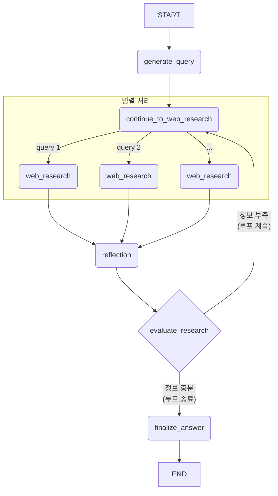

# Quickstart 프로젝트: LangGraph 아키텍처 코드 분석

## 1. 개요

본 문서는 `quickstart/backend` 프로젝트의 LangGraph 기반 AI 에이전트를 코드 레벨에서 상세히 분석합니다. 이 에이전트는 Google Gemini 2.0/2.5 모델과 Google Search API를 활용하여 자율적인 웹 검색과 결과 평가를 반복하며 깊이 있는 답변을 생성하는 '리서처(Researcher)' 역할을 수행합니다.

## 2. 프로젝트 구조

```
quickstart/backend/src/agent/
├── __init__.py          # 패키지 초기화
├── app.py              # FastAPI 애플리케이션 엔트리포인트
├── configuration.py    # 설정 클래스 정의
├── graph.py           # LangGraph 정의 및 노드 구현
├── prompts.py         # 각 노드별 프롬프트 템플릿
├── state.py           # 그래프 상태 정의
├── tools_and_schemas.py # Pydantic 스키마 정의
└── utils.py           # 유틸리티 함수들
```

## 3. 상태 (State) 정의

### 3.1. OverallState - 메인 상태

```python
class OverallState(TypedDict):
    messages: Annotated[list, add_messages]           # 대화 기록
    search_query: Annotated[list, operator.add]       # 실행된 검색어 목록
    web_research_result: Annotated[list, operator.add] # 웹 검색 결과 요약본 목록
    sources_gathered: Annotated[list, operator.add]   # 수집된 정보 출처 목록
    initial_search_query_count: int                   # 초기 생성할 검색어 수
    max_research_loops: int                           # 최대 리서치 루프 횟수
    research_loop_count: int                          # 현재 실행된 루프 횟수
    reasoning_model: str                              # 추론에 사용할 모델명
```

### 3.2. 보조 상태들

```python
class ReflectionState(TypedDict):
    is_sufficient: bool                               # 정보 충분성 여부
    knowledge_gap: str                                # 부족한 정보 설명
    follow_up_queries: Annotated[list, operator.add] # 추가 검색어 목록
    research_loop_count: int
    number_of_ran_queries: int

class QueryGenerationState(TypedDict):
    search_query: list[Query]                         # 생성된 검색어와 근거

class WebSearchState(TypedDict):
    search_query: str                                 # 단일 검색어
    id: str                                          # 검색 ID
```

## 4. 노드 (Nodes) 상세 분석

### 4.1. generate_query - 검색어 생성 노드

```python
def generate_query(state: OverallState, config: RunnableConfig) -> QueryGenerationState:
```

**핵심 로직:**
1. **모델 초기화**: `ChatGoogleGenerativeAI`로 Gemini 2.0 Flash 모델 설정
2. **구조화된 출력**: `SearchQueryList` 스키마로 JSON 형태 검색어 생성
3. **프롬프트 구성**: 
   - 현재 날짜 포함으로 최신 정보 검색 보장
   - 사용자 질문에서 연구 주제 추출 (`get_research_topic`)
   - 설정된 검색어 개수만큼 생성 (기본값: 3개)

**프롬프트 특징:**
```python
query_writer_instructions = """Your goal is to generate sophisticated and diverse web search queries...
- Always prefer a single search query, only add another query if the original question requests multiple aspects
- Each query should focus on one specific aspect of the original question
- Don't produce more than {number_queries} queries
- Queries should be diverse, if the topic is broad, generate more than 1 query
```

### 4.2. continue_to_web_research - 병렬 처리 분산 노드

```python
def continue_to_web_research(state: QueryGenerationState):
    return [
        Send("web_research", {"search_query": search_query, "id": int(idx)})
        for idx, search_query in enumerate(state["search_query"])
    ]
```

**핵심 기능:**
- LangGraph의 `Send` 이벤트를 사용한 동적 병렬 처리
- 각 검색어마다 별도의 `web_research` 노드 인스턴스 생성
- 고유 ID 할당으로 검색 결과 추적

### 4.3. web_research - 웹 검색 및 요약 노드

```python
def web_research(state: WebSearchState, config: RunnableConfig) -> OverallState:
```

**핵심 로직:**
1. **Google Search API 호출**: `genai_client.models.generate_content`로 직접 호출
2. **도구 설정**: `{"tools": [{"google_search": {}}]}`로 검색 기능 활성화
3. **URL 단축**: `resolve_urls`로 긴 URL을 짧은 형태로 변환 (토큰 절약)
4. **인용 처리**: `get_citations`와 `insert_citation_markers`로 출처 표시

**특별한 점:**
- LangChain 클라이언트 대신 Google GenAI 클라이언트 직접 사용
- 이유: grounding metadata 반환을 위해 필요

### 4.4. reflection - 자기 평가 노드

```python
def reflection(state: OverallState, config: RunnableConfig) -> ReflectionState:
```

**핵심 로직:**
1. **루프 카운터 증가**: `research_loop_count` 자동 증가
2. **모델 선택**: Gemini 2.5 Flash (추론 전용 모델)
3. **구조화된 출력**: `Reflection` 스키마로 평가 결과 반환
4. **지식 격차 분석**: 모든 요약본을 종합하여 부족한 부분 식별

**프롬프트 지시사항:**
```python
reflection_instructions = """You are an expert research assistant analyzing summaries...
- Identify knowledge gaps or areas that need deeper exploration
- If provided summaries are sufficient to answer the user's question, don't generate a follow-up query
- Focus on technical details, implementation specifics, or emerging trends that weren't fully covered
```

### 4.5. evaluate_research - 조건부 라우팅 함수

```python
def evaluate_research(state: ReflectionState, config: RunnableConfig) -> OverallState:
```

**분기 로직:**
1. **종료 조건**: `is_sufficient=True` 또는 `research_loop_count >= max_research_loops`
2. **계속 조건**: 추가 검색어를 `Send` 이벤트로 `web_research`에 전달
3. **동적 ID 생성**: 기존 쿼리 수 + 인덱스로 고유 ID 할당

### 4.6. finalize_answer - 최종 답변 생성 노드

```python
def finalize_answer(state: OverallState, config: RunnableConfig):
```

**핵심 로직:**
1. **모델 선택**: Gemini 2.5 Pro (최고 성능 모델)
2. **출처 복원**: 단축 URL을 원본 URL로 복원
3. **중복 제거**: 실제 사용된 출처만 필터링
4. **마크다운 형식**: 최종 답변을 마크다운으로 포맷팅

## 5. 설정 (Configuration) 시스템

```python
class Configuration(BaseModel):
    query_generator_model: str = "gemini-2.0-flash"      # 검색어 생성용
    reflection_model: str = "gemini-2.5-flash"           # 평가용
    answer_model: str = "gemini-2.5-pro"                 # 최종 답변용
    number_of_initial_queries: int = 3                   # 초기 검색어 수
    max_research_loops: int = 2                          # 최대 루프 수
```

**특징:**
- 환경변수와 런타임 설정 모두 지원
- 각 단계별로 최적화된 모델 사용
- 동적 설정 변경 가능

## 6. 유틸리티 함수들

### 6.1. get_research_topic
- 단일 메시지: 그대로 반환
- 대화 기록: "User: ... Assistant: ..." 형태로 연결

### 6.2. resolve_urls
- 긴 Vertex AI Search URL을 `https://vertexaisearch.cloud.google.com/id/{id}-{idx}` 형태로 단축
- 토큰 사용량 최적화

### 6.3. insert_citation_markers
- 텍스트에 인용 마커 삽입
- 역순 정렬로 인덱스 충돌 방지

### 6.4. get_citations
- Gemini 응답의 grounding metadata에서 인용 정보 추출
- 마크다운 링크 형태로 변환

## 7. 그래프 구성

```python
builder = StateGraph(OverallState, config_schema=Configuration)

# 노드 추가
builder.add_node("generate_query", generate_query)
builder.add_node("web_research", web_research)
builder.add_node("reflection", reflection)
builder.add_node("finalize_answer", finalize_answer)

# 엣지 구성
builder.add_edge(START, "generate_query")
builder.add_conditional_edges("generate_query", continue_to_web_research, ["web_research"])
builder.add_edge("web_research", "reflection")
builder.add_conditional_edges("reflection", evaluate_research, ["web_research", "finalize_answer"])
builder.add_edge("finalize_answer", END)
```

## 8. 핵심 아키텍처 특징

### 8.1. 동적 병렬 처리
- `Send` 이벤트로 검색어 개수만큼 동적으로 노드 생성
- 각 검색이 독립적으로 실행되어 성능 최적화

### 8.2. 자기 평가 루프
- `reflection` 노드가 스스로 정보 충분성 판단
- 부족한 부분을 구체적으로 식별하여 추가 검색 지시

### 8.3. 모델 계층화
- 검색어 생성: Gemini 2.0 Flash (빠른 처리)
- 평가/추론: Gemini 2.5 Flash (균형)
- 최종 답변: Gemini 2.5 Pro (최고 품질)

### 8.4. 출처 추적 시스템
- grounding metadata 활용한 정확한 출처 표시
- URL 단축으로 토큰 효율성과 추적성 동시 확보

## 9. 데이터 흐름



이 아키텍처는 단순한 검색-응답이 아닌, 점진적 지식 축적을 통한 고품질 리서치를 구현한 것이 핵심 특징입니다.

## 10. ReAct 패턴으로의 전환 방안

현재 아키텍처를 ReAct (Reasoning and Acting) 패턴으로 변경할 수 있습니다. ReAct는 **Thought → Action → Observation** 사이클을 명시적으로 구현하는 패턴입니다.

### 10.1. ReAct 패턴 개요

```
Thought: 현재 상황을 분석하고 다음 행동을 계획
Action: 구체적인 도구 사용 (웹 검색, 계산 등)
Observation: 행동 결과를 관찰하고 분석
```

### 10.2. 현재 구조 vs ReAct 구조

**현재 구조:**
```
generate_query → web_research → reflection → (루프) → finalize_answer
```

**ReAct 구조:**
```
react_step → react_step → react_step → ... → final_answer
```

### 10.3. ReAct 구현 방안

#### A. 상태 수정

```python
class ReActState(TypedDict):
    messages: Annotated[list, add_messages]
    thoughts: Annotated[list, operator.add]      # 사고 과정 기록
    actions: Annotated[list, operator.add]       # 수행한 행동들
    observations: Annotated[list, operator.add]  # 관찰 결과들
    step_count: int                              # 현재 단계
    max_steps: int                               # 최대 단계 수
    is_complete: bool                            # 완료 여부
    final_answer: str                            # 최종 답변
```

#### B. ReAct 노드 구현

```python
def react_step(state: ReActState, config: RunnableConfig) -> ReActState:
    """ReAct 패턴의 단일 스텝을 실행하는 노드"""
    
    # 1. Thought: 현재 상황 분석 및 다음 행동 계획
    thought_prompt = f"""
    질문: {get_research_topic(state["messages"])}
    
    지금까지의 사고 과정:
    {chr(10).join(state.get("thoughts", []))}
    
    지금까지의 관찰 결과:
    {chr(10).join(state.get("observations", []))}
    
    현재 상황을 분석하고 다음에 무엇을 해야 할지 생각해보세요.
    
    형식:
    Thought: [현재 상황 분석 및 다음 행동 계획]
    Action: [수행할 구체적 행동 - search, calculate, finish 중 하나]
    Action Input: [행동에 필요한 입력값]
    """
    
    # 2. LLM으로 Thought와 Action 생성
    llm = ChatGoogleGenerativeAI(model="gemini-2.5-flash")
    response = llm.invoke(thought_prompt)
    
    # 3. 응답 파싱
    thought, action, action_input = parse_react_response(response.content)
    
    # 4. Action 실행
    if action == "search":
        observation = execute_web_search(action_input)
    elif action == "calculate":
        observation = execute_calculation(action_input)
    elif action == "finish":
        return {
            "is_complete": True,
            "final_answer": action_input,
            "thoughts": [thought],
            "actions": [f"{action}: {action_input}"],
            "observations": ["Task completed"],
            "step_count": state["step_count"] + 1
        }
    else:
        observation = f"Unknown action: {action}"
    
    # 5. 상태 업데이트
    return {
        "thoughts": [thought],
        "actions": [f"{action}: {action_input}"],
        "observations": [f"Observation: {observation}"],
        "step_count": state["step_count"] + 1,
        "is_complete": False
    }

def should_continue(state: ReActState) -> str:
    """ReAct 루프 계속 여부 결정"""
    if state["is_complete"] or state["step_count"] >= state["max_steps"]:
        return "format_final_answer"
    return "react_step"

def format_final_answer(state: ReActState, config: RunnableConfig):
    """최종 답변 포맷팅"""
    if state["is_complete"]:
        final_content = state["final_answer"]
    else:
        # 최대 스텝 도달 시 강제 종료
        final_content = generate_final_answer_from_observations(
            state["observations"], 
            state["thoughts"]
        )
    
    return {"messages": [AIMessage(content=final_content)]}
```

#### C. 그래프 구성

```python
# ReAct 그래프 구성
builder = StateGraph(ReActState, config_schema=Configuration)

builder.add_node("react_step", react_step)
builder.add_node("format_final_answer", format_final_answer)

builder.add_edge(START, "react_step")
builder.add_conditional_edges("react_step", should_continue, 
                             ["react_step", "format_final_answer"])
builder.add_edge("format_final_answer", END)
```

### 10.4. ReAct 프롬프트 예시

```python
react_prompt = """당신은 ReAct 패턴을 따르는 연구 에이전트입니다.

사용 가능한 도구:
- search: 웹 검색 수행
- calculate: 수학 계산 수행  
- finish: 최종 답변 제공

각 단계에서 다음 형식을 정확히 따라주세요:

Thought: [현재 상황 분석 및 계획]
Action: [도구명]
Action Input: [도구 입력값]

예시:
Thought: 사용자가 애플의 2024년 매출에 대해 질문했습니다. 최신 재무 정보를 검색해야 합니다.
Action: search
Action Input: Apple 2024 annual revenue financial results

Thought: 검색 결과를 통해 애플의 2024년 매출이 3850억 달러임을 확인했습니다. 이제 답변을 완성할 수 있습니다.
Action: finish
Action Input: 애플의 2024년 매출은 3850억 달러입니다. 이는 전년 대비 2% 증가한 수치입니다.
"""
```

### 10.5. 장단점 비교

#### ReAct 패턴의 장점:
- **투명성**: 각 단계의 사고 과정이 명확히 드러남
- **유연성**: 다양한 도구를 동적으로 선택 가능
- **디버깅**: 어느 단계에서 문제가 발생했는지 쉽게 추적
- **일반화**: 웹 검색 외 다른 태스크에도 적용 가능

#### 현재 구조의 장점:
- **효율성**: 병렬 검색으로 빠른 정보 수집
- **구조화**: 명확한 단계별 처리
- **최적화**: 웹 검색에 특화된 성능

### 10.6. 하이브리드 접근법

두 방식의 장점을 결합한 하이브리드 구조도 가능합니다:

```python
def hybrid_react_step(state: HybridState, config: RunnableConfig):
    """ReAct 패턴 + 병렬 처리 하이브리드"""
    
    # Thought: 계획 수립
    thought = generate_thought(state)
    
    # Action: 복수 검색어 생성 (기존 방식)
    if should_search_multiple(thought):
        queries = generate_multiple_queries(thought)
        # 병렬 검색 실행
        observations = parallel_web_search(queries)
    else:
        # 단일 검색 실행
        observation = single_web_search(thought)
        observations = [observation]
    
    # Observation: 결과 종합
    combined_observation = synthesize_observations(observations)
    
    return update_state(thought, observations, combined_observation)
```

### 10.7. 구현 권장사항

1. **점진적 전환**: 기존 구조를 유지하면서 ReAct 요소를 단계적으로 추가
2. **도구 확장**: 웹 검색 외에 계산, 데이터 분석 등 다양한 도구 지원
3. **프롬프트 최적화**: 한국어 환경에 맞는 ReAct 프롬프트 개발
4. **성능 모니터링**: ReAct 전환 후 응답 품질과 속도 비교 분석

ReAct 패턴으로 전환하면 더 투명하고 유연한 에이전트를 구축할 수 있지만, 현재 구조의 효율성과 특화된 성능을 고려하여 신중히 결정해야 합니다.
