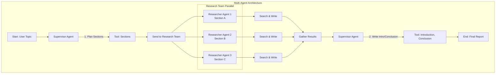

# Open Deep Research 소스 코드 분석

`deepresearch`는 LangGraph를 활용하여 심층적인 주제에 대한 리서치 보고서를 자동 생성하는 두 가지 방식의 에이전트 아키텍처를 제공합니다.

1.  **멀티 에이전트 (Multi-agent)**: `supervisor`와 `researcher` 역할을 나누어 병렬로 작업을 처리하며 속도를 중시하는 구조입니다.
2.  **그래프 기반 워크플로우 (Graph-based Workflow)**: `계획 -> 검토 -> 실행` 단계를 거치며 사용자의 피드백을 통해 결과물의 품질을 높이는 데 중점을 둔 구조입니다.

## 아키텍처 다이어그램

### 멀티 에이전트 아키텍처 (multi_agent.py)

### 그래프 기반 워크플로우 (graph.py)

```mermaid
graph TD
    subgraph "Graph-based Workflow"
        GW_START["Start: User Topic"] --> GW_PLAN["1. Generate Report Plan"]
        GW_PLAN --> GW_HUMAN["2. Human Feedback interrupt"]
        GW_HUMAN -->|"Feedback"| GW_PLAN
        GW_HUMAN -->|"Approve"| GW_RESEARCH_SECTIONS["3. Research Sections in Parallel"]
        
        subgraph "Section Research Sub-Graph"
            GW_SUB_START["Start Section"] --> GW_QUERY["Generate Queries"]
            GW_QUERY --> GW_SEARCH["Search Web"]
            GW_SEARCH --> GW_WRITE["Write Section"]
            GW_WRITE --> GW_GRADE["Self-Correct?<br/>Grader"]
            GW_GRADE -->|"More Info Needed"| GW_SEARCH
            GW_GRADE -->|"Section OK"| GW_SUB_END["End Section"]
        end

        GW_RESEARCH_SECTIONS --> GW_SUB_START
        GW_SUB_END --> GW_GATHER_SECTIONS["4. Gather Completed Sections"]
        GW_GATHER_SECTIONS --> GW_COMPILE["5. Compile Final Report"]
        GW_COMPILE --> GW_END["End: Final Report"]
    end
```

## 1. 멀티 에이전트 (`multi_agent.py`)

감독자-연구원(Supervisor-Worker) 패턴을 사용하여 신속한 보고서 생성을 목표로 합니다.

### 핵심 구성 요소

-   **State**:
    -   `ReportState`: 전체 보고서 생성 과정을 관리합니다. 연구할 `sections` 목록, `completed_sections`, 최종 보고서(`final_report`) 등을 추적합니다.
    -   `SectionState`: 개별 연구원 에이전트가 담당하는 단일 `section`의 상태를 관리합니다.
-   **Agents**:
    -   `supervisor`: 오케스트레이터 역할을 합니다. 사용자 요청을 받아 `Sections` 도구를 호출하여 전체 보고서의 구조를 계획합니다. 모든 섹션 연구가 완료되면, 서론(`Introduction`)과 결론(`Conclusion`)을 작성하고 최종 보고서를 취합합니다.
    -   `research_agent`: 작업자 역할을 합니다. 감독자로부터 특정 `section`을 할당받아, 검색 도구(`Tavily`, `DuckDuckGo` 등)를 사용해 정보를 수집하고 해당 섹션의 내용을 작성합니다.
-   **Tools**:
    -   설정(`search_api`, `mcp_server_config` 등)에 따라 동적으로 도구가 생성됩니다.
    -   **Supervisor Tools**: `Sections`, `Introduction`, `Conclusion`, `Question` (사용자에게 질문), `FinishReport` 등
    -   **Researcher Tools**: `Section` (완성된 섹션 제출), `FinishResearch`, 검색 도구 등
-   **Workflow (LangGraph)**:
    1.  `supervisor`가 사용자 요청을 분석하여 보고서 섹션을 계획합니다.
    2.  `Send` 명령을 통해 각 섹션에 대한 연구 과업을 `research_team` (연구원 에이전트 그룹)에게 병렬로 전달합니다.
    3.  각 `research_agent`는 독립적인 하위 그래프(`research_agent_graph`) 내에서 `검색 -> 작성` 루프를 실행합니다.
    4.  모든 연구원이 작업을 완료하면, `supervisor`가 다시 활성화되어 수집된 `completed_sections`를 바탕으로 서론과 결론을 추가하고 최종 보고서를 생성합니다.

이 구조는 각 에이전트가 독립적으로 병렬 작업을 수행하므로 효율성과 속도에 강점이 있습니다.

### 멀티 에이전트 모드에서의 품질 보장 전략

멀티 에이전트(`multi_agent.py`) 아키텍처는 속도를 우선하지만, 다음과 같은 메커니즘으로 품질을 확보합니다.

| 단계 | 품질 메커니즘 | 설명 |
|------|---------------|------|
| **1. Section Planning** | Supervisor LLM + `Sections` Tool | 보고서 구조를 먼저 명시적으로 정의해 누락 주제를 방지합니다. |
| **2. 병렬 Researcher Agents** | **다중 관점** | 각 섹션을 서로 다른 에이전트가 독립적으로 조사·작성해 편향을 완화하고 정보 다양성을 확보합니다. |
| **3. Researcher 자체 검토** | Section 제출 전 **자체 LLM self-check** | Researcher가 작성한 섹션 초안을 LLM으로 재검토하고, 부족하면 추가 검색→수정 루프를 수행합니다. |
| **4. Supervisor 집계** | **Cross-Section Review** | 모든 섹션이 모이면 Supervisor가 서론·결론 작성 전 각 섹션 내용을 스캔하여 일관성·중복 여부를 확인합니다. |
| **5. 최종 Introduction / Conclusion** | Context-Aware LLM 작성 | Supervisor가 전체 섹션을 컨텍스트로 받아 서론·결론을 작성하면서 자연스럽게 내용 연결과 요약 검증을 수행합니다. |

#### 포인트 요약

1. **다중 시각**: 여러 에이전트가 동시에 작업해 정보 출처와 서술 관점이 다양해집니다.
2. **두 단계 검토**: (Researcher Self-Check) → (Supervisor Cross-Check)를 거쳐 오류 가능성을 줄입니다.
3. **중앙 오케스트레이션**: 최종 품질 책임을 Supervisor가 지며, 일관성과 형식 준수를 마지막에 한 번 더 확인합니다.

## 2. 그래프 기반 워크플로우 (`graph.py`)

'계획-실행(Plan-and-Execute)'에 '인간 피드백(Human-in-the-Loop)'을 결합하여 보고서의 품질과 정확성을 높이는 데 중점을 둡니다.

### 핵심 구성 요소

-   **State**:
    -   `ReportState`: `topic`, `sections`, `feedback_on_report_plan`, 최종 보고서 등을 관리합니다.
    -   `SectionState`: 섹션별 연구 하위 그래프의 상태(검색 쿼리, 검색 결과, 내용 등)를 관리합니다.
-   **Workflow (LangGraph)**:
    1.  **`generate_report_plan` (계획)**: 사용자 `topic`을 받아 초기 웹 검색을 수행하고, 그 컨텍스트를 활용해 LLM이 보고서 전체 계획(`Sections`)을 생성합니다.
    2.  **`human_feedback` (검토)**: `interrupt()`를 통해 그래프 실행을 일시 중지하고, 생성된 계획을 사용자에게 보여줍니다.
        -   **승인 (`True`)**: 다음 단계인 섹션별 연구로 진행합니다.
        -   **피드백 (`str`)**: 사용자의 피드백을 반영하여 `generate_report_plan` 노드를 다시 실행, 계획을 수정합니다.
    3.  **`build_section_with_web_research` (실행 - 하위 그래프)**: 승인된 계획에 따라 연구가 필요한 각 섹션에 대해 병렬적으로 하위 그래프를 실행합니다.
        -   **`generate_queries` -> `search_web` -> `write_section`**: 섹션 주제에 맞는 검색어 생성, 웹 검색, 내용 작성을 순차적으로 진행합니다.
        -   **`write_section` 내 자체 교정**: LLM이 `section_grader_instructions` 프롬프트를 사용해 자신이 작성한 내용의 품질을 스스로 평가합니다. 정보가 부족하다고 판단되면, `search_web` 노드로 다시 돌아가 추가 검색을 수행하는 **반성/개선 루프**를 실행합니다.
    4.  **`compile_final_report` (취합)**: 모든 섹션 작성이 완료되면, 결과물들을 하나로 모아 최종 보고서를 생성합니다.

이 구조는 사용자가 보고서의 방향을 직접 제어할 수 있고, 에이전트가 자체적으로 결과물을 개선하는 과정이 포함되어 있어 더 높은 품질의 결과물을 기대할 수 있습니다.

## 에이전트 / 노드 구성 요약

### 멀티 에이전트(`multi_agent.py`)

| 구성 요소 | Type | 핵심 책임 | 주요 함수 / 노드 |
|-----------|------|-----------|------------------|
| `supervisor` | Agent Node | • 사용자 요청 분석 및 섹션 계획 • 연구 결과(Section) 집계 및 최종 보고서 작성 | `supervisor`, `supervisor_tools`, `supervisor_should_continue` |
| `research_agent` | Agent Node (fan-out) | • 할당된 섹션에 대해 검색→작성 루프 수행 | `research_agent`, `research_agent_tools`, `research_agent_should_continue` |
| `ReportState` | LangGraph State | • 전체 진행 상황(섹션 리스트, 완료 섹션, 최종 보고서 등) 추적 | dataclass 정의 |
| `SectionState` | LangGraph State | • 개별 연구 섹션의 진행 상황 관리 | dataclass 정의 |
| `get_supervisor_tools()` | Helper | • `Sections`, `Introduction`, `Conclusion`, `Question`, `FinishReport` 등 동적 툴 바인딩 | 함수 |
| `get_research_tools()` | Helper | • `Section`, `FinishResearch`, 검색툴(Tavily / DuckDuckGo) 및 MCP 툴 로딩 | 함수 |

> 참고: Jupyter 예제(`multi_agent.ipynb`)에서는 `create_react_agent` 헬퍼를 사용해 같은 Supervisor/Researcher 툴 세트를 간편히 감싼 데모를 포함하고 있습니다. 실제 파이썬 구현(`multi_agent.py`)은 **직접 `bind_tools()`** 패턴을 사용하여 툴콜을 통제합니다.

### 그래프 기반 워크플로우(`graph.py`)

| 노드 | 역할 | 세부 내용 |
|------|------|-----------|
| `generate_report_plan` | 계획 수립 | • 초기 검색→LLM→보고서 섹션 구조 생성 |
| `human_feedback` | 사용자 피드백 | • `interrupt()`로 실행 중단 후 승인/수정 피드백 수집 |
| `generate_queries` | 검색어 생성 | • 섹션별 검색어 목록(Structured Output `Queries`) 생성 |
| `search_web` | 웹검색 실행 | • Tavily/Perplexity/Exa/ArXiv/PubMed 등 선택형 API 호출 결과를 `source_str`로 포맷 |
| `write_section` | 섹션 작성 | • LLM으로 초안 작성 → `section_grader_instructions`로 자체 평가 및 루프 |
| `write_final_sections` | Intro/Conclusion | • 연구不要 섹션(서론/결론 등) 작성 |
| `gather_completed_sections` | 결과 취합 | • 병렬 하위 그래프에서 반환된 섹션 마지합 |
| `compile_final_report` | 보고서 컴파일 | • 모든 섹션 + 서론/결론을 마크다운으로 결합 |
| `initiate_final_section_writing` | 흐름 제어 | • Intro/Conclusion 노드로 진입 트리거 |

상태 모델(`ReportState`, `SectionState`, 등`)은 `state.py`에 정의되어 있으며, 각 노드 간 파라메터 전달 및 체크포인터(예: Redis, Postgres Saver 등)를 통해 LangGraph 런타임에 저장될 수 있습니다.

### 검색 / MCP 툴 플러그인

- **검색(Search) 툴**: `open_deep_research.utils` 모듈의 `tavily_search`, `duckduckgo_search`, `select_and_execute_search` 등이 구현되어 있습니다. 설정값(`search_api`)에 따라 동적으로 주입됩니다.
- **MCP(Model Context Protocol) 툴**: `_load_mcp_tools()`가 `langchain_mcp_adapters.client.MultiServerMCPClient`를 사용해 원격 MCP 서버에서 툴 메타데이터를 가져와 Supervisor/Researcher 툴 목록에 삽입합니다.

이처럼 `deepresearch`는 **LangGraph의 StateGraph**를 기반으로, **동적 툴 바인딩 + 메시지 기반 상태 전이** 패턴을 활용해 복잡한 연구 파이프라인을 선언적으로 구축하고 있습니다.

## 사용 라이브러리 & 프롬프트 인덱스

### 핵심 라이브러리

| 카테고리 | 라이브러리 / 모듈 | 용도 |
|-----------|------------------|------|
| Agent & Graph | `langgraph.graph`, `langgraph.types`, `langgraph.constants` | • `StateGraph`, `Send`, `START/END` 노드, 조건 분기 등 그래프 정의/실행 |
| LLM & Tooling | `langchain.chat_models.init_chat_model`, `langchain_core.tools`, `langchain_core.messages`, `langchain_core.runnables` | • LLM 초기화, Tool 정의 & 바인딩, 메시지 객체 관리 |
| 데이터 모델 | `pydantic.BaseModel`, `typing.Annotated`, `typing.TypedDict` | • 상태/툴 I/O 스키마 정의 |
| 병렬 검색 | `asyncio`, `operator` 내장 모듈 | • 상태 병합 연산 (`operator.add`) 등 |
| MCP (옵션) | `langchain_mcp_adapters.client.MultiServerMCPClient` | • 원격 MCP 서버에서 툴 메타데이터 로드 |
| 검색 유틸 | `open_deep_research.utils` | • `tavily_search`, `duckduckgo_search`, `select_and_execute_search` 등 |

### 프롬프트 인덱스

멀티 에이전트(`open_deep_research/prompts.py`)

| Index | 변수명 | 사용 위치 |
|-------|--------|-----------|
| MA-P1 | `SUPERVISOR_INSTRUCTIONS` | `supervisor` 시스템 프롬프트 |
| MA-P2 | `RESEARCH_INSTRUCTIONS` | `research_agent` 시스템 프롬프트 |

그래프 워크플로우(`open_deep_research/prompts.py` & `workflow/prompts.py`)

| Index | 변수명 | 사용 노드 |
|-------|--------|-----------|
| WF-P1 | `report_planner_query_writer_instructions` | `generate_report_plan` (검색 쿼리 작성) |
| WF-P2 | `report_planner_instructions` | `generate_report_plan` (섹션 계획) |
| WF-P3 | `query_writer_instructions` | `generate_queries` |
| WF-P4 | `section_writer_instructions` | `write_section`, `write_final_sections` |
| WF-P5 | `final_section_writer_instructions` | `write_final_sections` |
| WF-P6 | `section_grader_instructions` | `write_section` 내부 자체 평가 |
| WF-P7 | `section_writer_inputs` | `write_section` 입력 포맷 템플릿 |
| WF-P8 | `clarify_with_user_instructions` | (옵션) 사용자가 명확화 질문 단계 활성화 시 |

> 프롬프트 문자열은 `/deepresearch/src/open_deep_research/(prompts.py|workflow/prompts.py)` 파일에 정의되어 있으며, Jinja-style 플레이스홀더(`{topic}`, `{section_topic}` 등)로 런타임 정보를 주입합니다. 필요 시 인덱스를 참고해 세부 내용을 확인하면 됩니다.

## 3. 품질을 높이는 메커니즘 (Plan → Review → Execute 루프)

Open Deep Research의 그래프 워크플로우는 **계획 → 검토 → 실행** 단계를 반복하며, 두 가지 피드백 루프를 통해 결과물의 품질을 지속적으로 개선합니다.

| 단계 | 품질 보증 포인트 | 세부 설명 |
|------|-----------------|-----------|
| **1. Generate Report Plan** | ‑ | LLM이 초기 검색·컨텍스트를 바탕으로 섹션 구조를 생성합니다. |
| **2. Human Feedback** | **외부 피드백 루프** | `interrupt()`를 사용해 그래프 실행을 일시 중지하고 사용자에게 계획을 보여줍니다. • 사용자가 **승인** 시 다음 단계로 진행 • **피드백** 입력 시 `generate_report_plan`으로 되돌아가 섹션 구조를 재생성합니다. |
| **3. Section Research Sub-Graph** | **내부 반성 루프** | 각 섹션은 `generate_queries → search_web → write_section` 순서로 작성됩니다. `write_section` 후 LLM-Grader(`section_grader_instructions`)가 **Pass / Fail**을 판정: • **Fail** → 부족한 정보를 바탕으로 새 검색 쿼리를 생성하고 `search_web`로 **루프 백** • **Pass** 또는 `max_search_depth` 초과 → 섹션 완료 |
| **4. Compile Final Report** | ‑ | 모든 섹션이 통과되면 서론·결론을 추가하고 보고서를 컴파일합니다. |

### 핵심 효과

1. **사용자 맞춤도 향상**: 보고서 계획 단계에서 사용자가 직접 승인/수정할 수 있으므로 결과물이 요구사항에 더 부합합니다.
2. **정보 정확도**: 섹션별 LLM-Grader가 부족한 근거를 감지해 추가 검색을 유도함으로써 팩트 누락/왜곡을 최소화합니다.
3. **자동 vs 인간 협업**: 인간 피드백 루프는 고품질이 필요한 초기 설계를 보장하고, 이후 세부 내용은 에이전트 반성 루프로 자동 개선해 **품질과 생산성을 동시에** 확보합니다.
